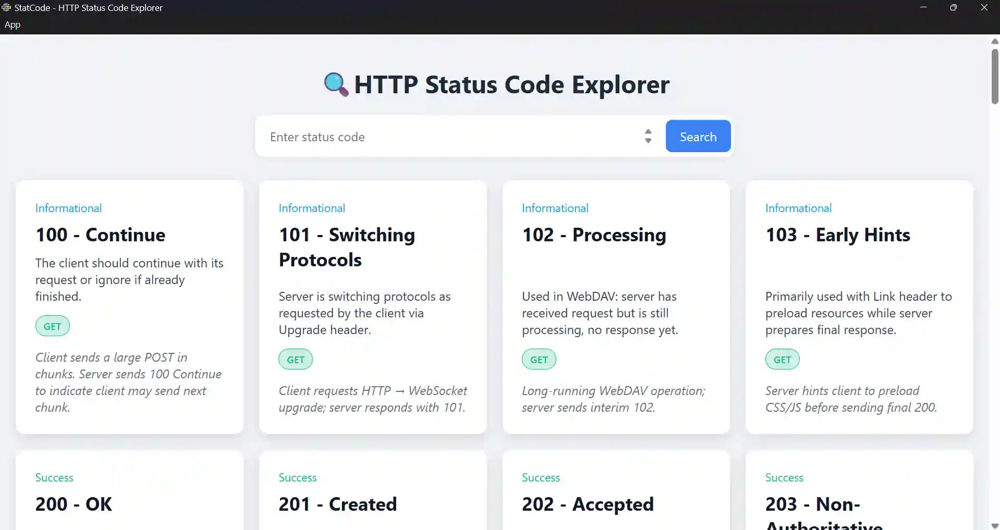

# StatCode — HTTP Status Code Explorer 🔍

A minimal desktop **Electron** app that helps you quickly learn and search all HTTP status codes in a small searchable grid of status-code cards.

## App UI 📸



## Features ✅

1. **Searchable** library of HTTP status codes with names, categories, and examples.
2. **Categorized** card layout — Informational, Success, Redirection, Client & Server Errors.
3. **Offline** support with all data bundled in [statusCodes.json](./app/statusCodes.json).

## Installation ⚡

- **Clone the repository:**
  ```bash
  git clone https://github.com/beniamin-hekimian/stat-code.git
  cd StatCode
  ```
- **Install dependencies:**
  ```bash
  npm install
  ```
- **Run the app:**
  ```bash
  npm run start
  ```

## What I Learned 📚

1️⃣ **Electron Essentials:**

- Managed the `main` and `renderer` process logic.
- Built a custom app menu and About dialog in main.js.

2️⃣ **Dynamic UI:**

- Rendered cards from statusCodes.json using `fetch()`.
- Implemented responsive search and keyboard interactions.

3️⃣ **App Packaging:**

- Bundled the project using `@electron/packager`.
- Learned cross-platform builds for Windows, macOS, and Linux.

## Technologies Used 🛠️

- ⚡ Electron
- 🌐 HTML/CSS/JavaScript
- 🗂 JSON (status code dataset)

## Project Structure 📁

- `/app` — Contains the main UI files, scripts, and the status code data.
- `/assets` — Holds icons, images, and other visual assets.
- `main.js` — The Electron entry point managing windows and menus.
- `package.json` — Defines dependencies, scripts, and build configuration.

## Conclusion 🎉

Developed by **Beniamin Hekimian**.

Feel free to reach out! ✉️